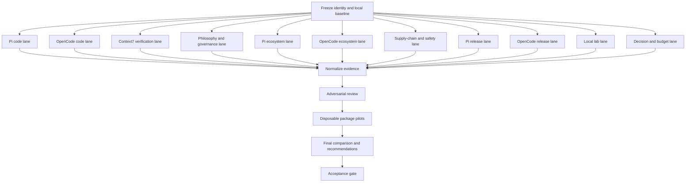

# TODO - Riset Pi vs OpenCode untuk Coding Ricing

## Goal

- [ ] Menghasilkan perbandingan berbasis kode dan sumber resmi antara Pi dan OpenCode.
- [ ] Menjelaskan philosophy masing-masing tanpa menyamakan opini dengan fakta implementasi.
- [ ] Memetakan ekosistem plugin, extension, package, MCP, dan skill yang relevan untuk coding workflow.
- [ ] Menemukan package yang layak dicoba untuk ricing environment secara aman dan reproducible.
- [ ] Membaca release notes sejak fase launch yang relevan sampai versi terkini.
- [ ] Menghasilkan rekomendasi terpisah untuk Pi, OpenCode, dan kombinasi keduanya.

## Execution Status

- [x] Baseline lokal dan repository identity dikumpulkan.
- [x] Context7 library resolution dan architecture/plugin cross-check dikumpulkan.
- [x] Code architecture, philosophy, governance, ecosystem, package-risk, dan local-baseline findings dikumpulkan.
- [x] Pi changelog inventory dibuat: 274 numbered releases plus one `Unreleased` row.
- [x] Pi feature-event inventory dibuat: 2,898 meaningful event rows plus 11 empty-release rows.
- [x] Pi pre-`0.10.0` launch/package/tag boundaries dibuat sebagai crosswalk terpisah.
- [ ] Full OpenCode per-release inventory dan disposable package pilots belum dijalankan.
- [ ] Permanent ricing changes belum dipromosikan ke dotfiles.

## Scope Defaults

- [ ] Perlakukan "launch" dalam tiga lapisan: repository scaffold pertama, coding-agent public release pertama, dan stable/major release pertama.
- [ ] Perlakukan package, plugin, extension, custom tool, MCP server, dan Agent Skill sebagai kategori terpisah.
- [ ] Prioritaskan source code, official docs, official changelog, Git tags/releases, dan registry metadata.
- [ ] Gunakan Context7 untuk orientasi API dan dokumentasi, lalu corroborate setiap claim penting terhadap source atau docs resmi yang dipin.
- [ ] Tandai setiap claim sebagai `EXTRACTED`, `INFERRED`, atau `AMBIGUOUS`.
- [ ] Freeze `as_of_utc`, research cutoff date, maximum candidate count, experiment cell count, dan token/time budget sebelum collection dimulai.
- [ ] Gunakan category enum `core`, `plugin`, `extension`, `package`, `custom-tool`, `MCP`, `skill`, `theme`, atau `config`.
- [ ] Jangan menyebut package "worth trying" sebelum melewati audit source, permission, maintenance, dan trial terisolasi.
- [ ] Jangan membandingkan setup minimal satu engine dengan setup riced engine lain tanpa membuat profile yang setara.
- [ ] Jangan mengubah config utama dotfiles selama fase riset atau static audit.

## Flow



## Phase 0 - Freeze Identity and Baseline

### Repository identity

- [ ] Verify repository Pi yang sedang aktif dan catat URL canonical, owner, default branch, HEAD SHA, latest tag, dan research date.
- [ ] Verify repository OpenCode yang sedang aktif dan catat URL canonical, owner, default branch, HEAD SHA, latest tag, dan research date.
- [ ] Audit alias atau repository lama sebelum mengambil data dari `badlogic/pi-mono`, `mariozechner/pi-coding-agent`, `sst/opencode`, dan `opencode-ai/opencode`.
- [ ] Simpan hasil identity check di `research/pi-opencode/source-manifest.json`.
- [ ] Catat apakah source yang dipakai adalah monorepo, package repository, mirror, fork, atau generated snapshot.

### Local baseline

- [ ] Catat `git status --short`, current branch, dan HEAD untuk `/home/raisal/dotfiles`.
- [ ] Catat versi OS, Node, npm, Bun, Pi, dan OpenCode tanpa menyimpan credential.
- [ ] Catat versi `@opencode-ai/plugin` pada `opencode-learn/package.json` dan lockfile.
- [ ] Verifikasi apakah dependency pada `opencode-learn/package.json` benar-benar diaktifkan oleh config `plugin` atau hanya ter-install.
- [ ] Audit effective config global, project, dan environment dengan command debug resmi tanpa menulis ke config utama.
- [ ] Inventarisir config Pi global, config Pi project, extension yang sudah ada, dan package Pi milik user.
- [ ] Hash file config yang menjadi baseline dan simpan manifest redacted di `research/pi-opencode/local-baseline.json`.
- [ ] Redact API key, refresh token, auth database, cookie, absolute personal path, dan secret dari semua artifact.
- [ ] Revalidate credential gate untuk benchmark live dan catat kegagalan tanpa menyimpan nilai credential.

### Evidence rules

- [ ] Tetapkan official source code dan pinned commit/tag sebagai evidence tertinggi untuk behavior implementasi.
- [ ] Tetapkan official docs dan release notes sebagai evidence utama untuk documented behavior dan intended philosophy.
- [ ] Tetapkan Context7 sebagai discovery dan API cross-check, bukan satu-satunya bukti.
- [ ] Tetapkan npm/GitHub registry sebagai sumber versi, tarball, provenance, dependency, dan publish metadata.
- [ ] Tandai blog, video, Reddit, issue comment, dan benchmark pihak ketiga sebagai secondary evidence.
- [ ] Buat `research/pi-opencode/evidence-ledger.md` sebelum menulis kesimpulan.

### Run budget and protected paths

- [ ] Set one immutable `run_id` and `as_of_utc` for each research run.
- [ ] Set maximum sub-agent concurrency, per-agent timeout, retry count, context budget, and artifact size before dispatch.
- [ ] Set maximum release rows, ecosystem candidates, pilot candidates, and benchmark cells before collection.
- [ ] Hash and inventory tracked, untracked, ignored, symlinked, and protected files before every live trial.
- [ ] Monitor writes, process creation, sockets, and network egress during every live trial.
- [ ] Fail closed when the required OS sandbox, container, or VM is unavailable.
- [ ] Mark any unexpected host write, secret match, undeclared egress, privilege bypass, or artifact drift as a failed run.

## Phase 1 - Sub-agent Work Allocation

### Parallel lanes

| ID | Lane | Tugas tunggal | Artifact |
|---|---|---|---|
| A | Source identity | Pin repo, branch, tag, redirect, dan release namespace | `source-manifest.json` |
| B | Pi architecture | Trace package boundary, agent loop, session, resource, TUI | `pi-code-notes.md` |
| C | OpenCode architecture | Trace server/client, core, session, protocol, plugin, TUI | `opencode-code-notes.md` |
| D | Context7 verifier | Query docs/API lalu corroborate hasil terhadap source resmi | `context7-notes.md` |
| E | Philosophy | Cari statement maintainer, design decision, governance, dan behavior yang mencerminkan philosophy | `philosophy-evidence.md` |
| F | Pi ecosystem | Catalog official/community Pi package dan extension | `pi-ecosystem.csv` |
| G | OpenCode ecosystem | Catalog plugin, custom tool, MCP, skill, dan ecosystem entry OpenCode | `opencode-ecosystem.csv` |
| H | Supply chain | Audit install script, permission, network, secret, provenance, dan maintenance | `package-risk-register.md` |
| I | Pi releases | Rekonstruksi release notes dan feature timeline Pi dari launch layers | `pi-release-timeline.csv` |
| J | OpenCode releases | Rekonstruksi release notes dan feature timeline OpenCode dari launch layers | `opencode-release-timeline.csv` |
| K | Local lab | Rancang profile, fixture, smoke test, metrics, dan isolation | `lab-plan.md` |
| L | Contrarian reviewer | Cari overlap, stale claim, asymmetric comparison, dan unsafe recommendation | `review-findings.md` |
| M | Decision and budget | Freeze workload, score, veto, budget, dan stop condition sebelum evidence collection | `decision-model.md` |

### Agent operating rules

- [ ] Jalankan lane A sampai K dan M secara paralel hanya setelah Phase 0 selesai.
- [ ] Berikan setiap sub-agent scope file dan pertanyaan yang tidak overlap dengan lane lain.
- [ ] Larang sub-agent riset mengedit source/config utama; output hanya ke artifact lane atau response terstruktur.
- [ ] Minta setiap sub-agent mengembalikan source URL, ref, symbol/heading, claim, evidence class, dan confidence.
- [ ] Minta setiap sub-agent mencatat `NOT_FOUND` daripada mengisi celah dengan asumsi.
- [ ] Jalankan lane L setelah semua artifact lane A sampai K dan M tersedia.
- [ ] Minta reviewer lane L memeriksa minimal lima claim paling penting per lane.
- [ ] Minta synthesizer terakhir menggabungkan artifact tanpa menimpa raw evidence.
- [ ] Dispatch lane A dan B sampai K melalui dependency DAG dengan satu writer untuk setiap artifact.
- [ ] Jangan jalankan lane yang membutuhkan identity, candidate catalog, atau baseline sebelum dependency-nya berstatus `VERIFIED`.
- [ ] Tulis artifact ke temporary path, validasi schema dan hash, lalu publish secara atomic.
- [ ] Simpan status `PENDING`, `RUNNING`, `PASSED`, `BLOCKED`, atau `FAILED` per lane.
- [ ] Retry hanya transient failure; jangan retry evidence conflict tanpa mengubah query atau source.
- [ ] Jalankan duplicate independent review untuk claim security, launch boundary, package risk, dan final recommendation.

### Required output schema

| Field | Isi wajib |
|---|---|
| `dimension` | Runtime, session, extension, config, security, release, ecosystem, UX, atau philosophy |
| `engine` | `pi` atau `opencode` |
| `claim_id` | ID stabil yang dipakai oleh semua artifact dan report |
| `category` | Core, plugin, extension, package, custom-tool, MCP, skill, theme, atau config |
| `claim` | Satu claim yang dapat diverifikasi |
| `observation` | Fakta atau hasil eksperimen |
| `source_type` | Source, docs, changelog, release, registry, Context7, atau experiment |
| `url_or_path` | URL atau path resmi |
| `ref` | Commit, tag, version, atau research date |
| `symbol_or_heading` | Function, class, heading, atau line range |
| `evidence_class` | `EXTRACTED`, `INFERRED`, atau `AMBIGUOUS` |
| `verification_status` | `VERIFIED`, `UNVERIFIED`, `NOT_FOUND`, `BLOCKED`, atau `CONFLICT` |
| `confidence` | High, medium, atau low dengan alasan |
| `reproduction` | Command atau langkah untuk mengulang hasil |
| `open_question` | Hal yang belum terverifikasi |
| `raw_source_refs` | Semua URL/path/ref yang dipakai untuk claim |
| `artifact_sha256` | Hash raw response atau artifact sumber |

## Phase 1.5 - Decision Model

- [ ] Define primary workloads before collecting scores: code navigation, deterministic fix/test, long-context review, delegation, safety boundary, and ricing/UX.
- [ ] Define primary metric, secondary metrics, minimum acceptable benefit, and maximum acceptable overhead for every workload.
- [ ] Define safety vetoes: host write, credential leak, undeclared egress, privilege bypass, missing integrity, missing sandbox, and unbounded lifecycle behavior.
- [ ] Apply safety vetoes before weighted usefulness scores; never average a safety failure away.
- [ ] Freeze score weights, thresholds, evaluator roles, and tie/no-winner rules before pilot results are visible.
- [ ] Treat Pi, OpenCode, and combined usage as separate decision targets.
- [ ] Report confidence interval or run range when a recommendation depends on repeated measurements.
- [ ] Require a second independent reviewer for every promotion to `TRY NOW` or permanent config.
- [ ] Keep `NO WINNER` as a valid result when benefit is below threshold or evidence remains asymmetric.

## Phase 2 - Code Comparison

### Pi code lane

- [ ] Inspect workspace boundary `packages/ai`, `packages/agent`, `packages/coding-agent`, dan `packages/tui`.
- [ ] Inspect agent core pada `packages/agent/src/agent.ts`, `agent-loop.ts`, dan `types.ts`.
- [ ] Inspect coding harness pada `agent-session.ts`, `agent-session-runtime.ts`, `agent-session-services.ts`, dan `resource-loader.ts`.
- [ ] Inspect `settings-manager.ts`, `session-manager.ts`, `messages.ts`, dan `system-prompt.ts`.
- [ ] Trace model API ke agent core, coding harness, TUI, dan CLI.
- [ ] Trace tool registration, tool execution, abort, retry, error, compaction, dan interruption.
- [ ] Trace `ExtensionAPI`, extension factory loading, lifecycle events, custom tools, commands, shortcuts, UI, dan custom entries.
- [ ] Trace project/global extension discovery pada `.pi/extensions/` dan `~/.pi/agent/extensions/`.
- [ ] Trace session JSONL, `id`, `parentId`, branch, compaction, resource loading, dan resume behavior.
- [ ] Trace settings merge, project trust, model config, auth config, dan package discovery.

### OpenCode code lane

- [ ] Inspect workspace boundary `packages/core`, `packages/opencode`, `packages/protocol`, `packages/schema`, `packages/plugin`, `packages/client`, `packages/sdk/js`, `packages/cli`, dan `packages/tui`.
- [ ] Inspect `packages/opencode/src/index.ts`, `agent/agent.ts`, `session/processor.ts`, `session/prompt.ts`, `session/tools.ts`, dan `plugin/loader.ts`.
- [ ] Inspect server boundary pada `packages/opencode/src/server/server.ts` dan API/client generation.
- [ ] Inspect `packages/core/src/agent.ts` dan `packages/core/src/config.ts`.
- [ ] Inspect generated protocol boundary pada `packages/sdk/js/src/gen/types.gen.ts`.
- [ ] Inspect plugin model pada `packages/plugin/src/v2/effect/README.md` dan implementation call path.
- [ ] Trace CLI/TUI ke server, session processor, provider request, tool call, event stream, dan SDK.
- [ ] Trace plugin loading, custom tool registration, hook timing, SDK access, compaction hook, dependency installation, dan reload requirement.
- [ ] Trace session message/part schema, snapshot, revert/redo, compaction, child session, and resume behavior.
- [ ] Trace JSON/JSONC config precedence, remote config, `OPENCODE_CONFIG`, project config, `.opencode/`, managed settings, dan environment substitution.

### Runtime comparison matrix

- [ ] Compare canonical agent loop and state object.
- [ ] Compare prompt transformation sampai provider request.
- [ ] Compare tool scheduling: sequential, parallel, queue, interrupt, dan cancellation.
- [ ] Compare retry, abort, compaction, provider error, dan recovery semantics.
- [ ] Compare persisted state versus runtime-only state.
- [ ] Compare model/provider/auth abstraction versus coding harness boundary.
- [ ] Compare TUI, CLI, print mode, RPC, HTTP, WebSocket, SDK, desktop, dan IDE surface.
- [ ] Compare branch/fork semantics dan context-window accounting.
- [ ] Compare context file, rule, prompt, skill, package, dan instruction discovery.
- [ ] Record source-confirmed behavior separately from inferred design intent.

## Phase 3 - Context7 Research

### Library resolution

- [ ] Resolve current Context7 library ID untuk repository Pi sebelum query.
- [ ] Resolve current Context7 library ID untuk repository OpenCode sebelum query.
- [ ] Resolve separate docs ID untuk Pi docs jika tersedia.
- [ ] Resolve separate docs/plugin ID untuk OpenCode docs jika tersedia.
- [ ] Simpan library ID, resolution date, benchmark/reputation metadata, dan version yang dipakai.

### Required queries

- [ ] Query boundary `pi-ai`, `pi-agent-core`, `pi-coding-agent`, `pi-tui`, `ResourceLoader`, `AgentSession`, dan extension factory.
- [ ] Query Pi SDK, `createAgentSession`, `AgentSessionRuntime`, `SessionManager`, JSONL persistence, branching, compaction, dan lifecycle.
- [ ] Query OpenCode client/server boundary, core versus application package, generated protocol/SDK, session runtime, dan plugin loader.
- [ ] Query OpenCode JavaScript SDK, `createOpencode`, `createOpencodeClient`, session API, event streaming, server lifecycle, dan version boundary.
- [ ] Query Pi extension API dan OpenCode plugin/custom tool API sebagai dua query terpisah.
- [ ] Query Pi settings/packages dan OpenCode config precedence sebagai dua query terpisah.
- [ ] Simpan raw Context7 response tanpa credential atau personal data.
- [ ] Simpan exact query, resolver result, library version/ref, corpus date, retrieval timestamp, response hash, dan claim IDs.
- [ ] Corroborate setiap Context7 claim terhadap pinned source atau official docs.
- [ ] Tandai claim yang hanya muncul di Context7 sebagai `UNVERIFIED` sampai source check selesai.
- [ ] Tandai Context7 result yang stale, conflict, unavailable, atau not found tanpa menggantinya dengan asumsi.
- [ ] Gunakan precedence source `pinned source > official docs/release > registry > Context7 > secondary source` saat evidence conflict.

### Context7 candidate IDs to verify

- [ ] Verify `/earendil-works/pi`.
- [ ] Verify `/websites/pi_dev`.
- [ ] Verify `/anomalyco/opencode`.
- [ ] Verify `/anomalyco/opencode-sdk-js`.
- [ ] Verify `/websites/opencode_ai_plugins`.

## Phase 4 - Philosophy, Governance, and Security

### Philosophy evidence

- [ ] Read README, official docs landing page, FAQ, manifesto/design notes, and maintainer statements untuk Pi.
- [ ] Read README, official docs landing page, changelog introduction, design notes, and maintainer statements untuk OpenCode.
- [ ] Use git history/blame untuk membedakan deliberate design dari incidental implementation.
- [ ] Map philosophy claims to observed defaults instead of inferring philosophy from feature count.
- [ ] Compare minimalism versus batteries-included behavior.
- [ ] Compare code-first extension versus declarative configuration approach.
- [ ] Compare global-first versus project-first customization.
- [ ] Compare user control, organization control, managed settings, dan trust boundary.
- [ ] Compare native subagent model, plan/build separation, hidden agent, and extension-provided delegation.
- [ ] Compare TUI/CLI/SDK/server priorities and intended audience.
- [ ] Link every philosophy claim to a dated maintainer statement, pinned code symbol/ref, observed default or experiment, counterevidence, and confidence.
- [ ] Pair code and philosophy evidence to the same release, or mark historical drift explicitly.

### Governance and security

- [ ] Inspect `LICENSE`, `SECURITY.md`, `CONTRIBUTING.md`, `AGENTS.md`, issue templates, release process, dan generated-code policy.
- [ ] Record license, copyright holder, maintainer/company identity, contribution rules, versioning, dan vulnerability reporting.
- [ ] Compare extension/package process privileges dengan agent tool permissions.
- [ ] Compare approval prompts, project trust, sandbox/container expectation, secret handling, network exposure, and rollback/snapshot behavior.
- [ ] Document that extensions/packages may have full system access when official docs state so.
- [ ] Treat agent permission config as defense-in-depth, bukan OS sandbox.
- [ ] Flag any package that reads auth files, launches child processes, opens network listeners, or installs global files.

## Phase 5 - Ecosystem Discovery

### Discovery sources

- [ ] Catalog official Pi package directory and Pi package/extension documentation.
- [ ] Catalog official OpenCode ecosystem page, plugin docs, custom tool docs, and MCP integration docs.
- [ ] Query npm registry for package metadata, tarball, versions, dependency tree, provenance, and publish dates.
- [ ] Query GitHub repository metadata for source, license, releases, commit activity, issues, and maintainers.
- [ ] Treat MCP Registry as namespace/metadata source, bukan quality approval.
- [ ] Treat Agent Skills specification as format source, bukan package quality registry.
- [ ] Capture packages already installed by the user before proposing duplicates.
- [ ] Freeze source universe, search terms, pagination method, inclusion/exclusion rules, deduplication rule, and cutoff date.
- [ ] Define canonical identity for package, repository, plugin, extension, MCP server, skill, and config snippet.
- [ ] Run typosquat and repository-to-tarball identity checks before scoring a candidate.
- [ ] Stop catalog discovery only after all defined sources are exhausted or the saturation threshold is reached.
- [ ] Publish a coverage report with source counts, deduplicated counts, excluded entries, and unresolved identities.

### Candidate intake schema

- [ ] Record package name, engine, category, source URL, current version, compatible CLI/API version, and install command.
- [ ] Record license, maintainer, repository age, latest release, release cadence, open issue age, and bus factor indicators.
- [ ] Record files included in tarball, runtime dependencies, peer dependencies, install scripts, postinstall behavior, and native binaries.
- [ ] Record filesystem access, child process access, network access, secret/auth access, model calls, browser/UI behavior, and global writes.
- [ ] Record provenance/signature status and exact integrity hash for the trial artifact.
- [ ] Record feature overlap with Pi/OpenCode core and with packages already installed.
- [ ] Record configuration surface, rollback procedure, uninstall procedure, and restart requirement.
- [ ] Record evidence quality and unresolved questions.

### Category-specific trust boundaries

- [ ] Use an in-process manifest for Pi extensions and OpenCode plugins, including hook mutation, process privilege, UI access, and reload behavior.
- [ ] Use an install-artifact manifest for npm packages and custom tools, including lifecycle scripts, transitive dependencies, and tarball integrity.
- [ ] Use a process/network manifest for MCP servers, including transport, child process, egress, auth, secret, and server lifetime.
- [ ] Use an instruction-content manifest for Agent Skills, including prompt injection surface, referenced files, commands, and intended tool permissions.
- [ ] Use a visual/config manifest for themes, keybinds, formatters, and LSP settings, including conflict, rollback, and native-equivalent behavior.
- [ ] Do not rank categories with one generic install or safety assumption.

### Worth-trying rubric

- [ ] Define `worth trying` as measurable workflow value, maintained source, reversible install, compatible API, and no unresolved hard safety blocker.
- [ ] Define `cool feature` as novel user-visible capability with clear coding or ricing value, not merely a large feature list.
- [ ] Score safety as a hard gate before scoring usefulness.
- [ ] Score coding fit, ricing/UX impact, reliability, maintenance, reversibility, performance cost, composability, and reproducibility from 0 to 5.
- [ ] Separate popularity, novelty, and quality scores.
- [ ] Use weighted score `fit 25% + UX 15% + reliability 15% + maintenance 15% + reversibility 10% + performance 10% + novelty 10%` after the safety gate.
- [ ] Mark `TRY NOW` at score >= 4.0 with no hard finding, `PILOT` at score 3.2-3.99 or unresolved low-risk uncertainty, `DEFER` below 3.2 with useful upside, and `AVOID` on any hard failure.
- [ ] Require a minimum measured benefit over the native/baseline profile before promoting a candidate.
- [ ] Keep `TRY`, `TRY NOW`, `PILOT`, `DEFER`, `REJECT`, and `AVOID` labels consistent across artifacts.
- [ ] Require a documented reason for every candidate marked `TRY`, `PILOT`, `DEFER`, or `REJECT`.
- [ ] Limit the first pilot wave to the highest-scoring low-risk candidates per category.

### Pi candidate queue for audit

- [ ] Audit `pi-powerline-footer` for ricing fit, persistent Bash mode, Git polling, queue behavior, file writes, and optional model calls.
- [ ] Audit `@plannotator/pi-extension` for plan/code review UI, browser behavior, network access, and provenance.
- [ ] Audit `@gotgenes/pi-permission-system` for fail-closed behavior, fork divergence, and non-sandbox limitations.
- [ ] Audit `pi-lens` for LSP integration, Node requirement, package size, install scripts, and runtime cost.
- [ ] Audit `pi-mcp-adapter` for OAuth, keyring access, MCP config discovery, child server launch, and credential exposure.
- [ ] Audit `pi-subagents` for foreground/background orchestration, overlap with existing delegation, and child isolation.
- [ ] Add user-owned Pi packages to the same intake schema before recommending new packages.

### OpenCode candidate queue for audit

- [ ] Audit native themes, keybinds, attention, commands, formatters, and LSP before installing third-party packages.
- [ ] Audit `@opencode-ai/plugin` API version against the installed OpenCode runtime.
- [ ] Audit `@tarquinen/opencode-dcp` with an exact pinned version and compare context behavior off/on.
- [ ] Audit `@plannotator/opencode` for postinstall global writes, command/skill copying, browser behavior, and disposable-config compatibility.
- [ ] Audit `opencode-pty` for PTY, WebSocket, external-directory, and permission semantics.
- [ ] Audit `opencode-vibeguard` for secret redaction boundary, plaintext tool arguments/output, maturity, and failure mode.
- [ ] Add current OpenCode plugins, MCPs, and local tools to the same intake schema before recommending duplicates.

### Static package audit

- [ ] Run `npm view` for metadata, versions, dependencies, dist-tags, provenance, and publish timestamps.
- [ ] Run `npm pack --dry-run` and record the exact file list before downloading a trial tarball.
- [ ] Inspect package scripts, especially `preinstall`, `install`, `postinstall`, and lifecycle-generated files.
- [ ] Inspect source for `child_process`, shell execution, filesystem traversal, auth file reads, network clients, server listeners, and telemetry.
- [ ] Run frozen install with scripts disabled for source inspection.
- [ ] Run signature/provenance and vulnerability checks available for the package manager.
- [ ] Audit the complete transitive dependency tree, URL/Git dependency, source-to-tarball correspondence, and MCP/skill distribution path.
- [ ] Reject an artifact with unknown integrity, unverifiable provenance, unexpected dependency, unexpected lifecycle script, or unexplained global write.
- [ ] Pin exact package version and integrity hash in every pilot manifest.
- [ ] Reject floating `latest` for benchmark or permanent config.

## Phase 6 - Release Notes Archaeology

### Release data collection

- [ ] Collect GitHub release pages, tags, tag commits, raw changelogs, npm version history, and official changelog pages for Pi.
- [ ] Collect GitHub release pages, tags, tag commits, raw changelogs, npm version history, and official changelog pages for OpenCode.
- [ ] Paginate release/tag APIs until the inclusive `first_launch` boundary is reached.
- [ ] Record missing tags, unpublished versions, prereleases, yanked versions, and changelog gaps.
- [ ] Preserve release date from tag, release page, changelog, and registry when they disagree.
- [ ] Record package-name transitions separately from product/repository transitions.
- [ ] Read every release note body and heading from `first_launch` through frozen `as_of_utc` for both engines.
- [ ] Create one inventory row per release/version/source record, including routine fixes, empty notes, and releases with no extractable feature.
- [ ] Reconcile GitHub releases, tags, changelog entries, and registry versions into matched and unmatched records.
- [ ] Record expected count, observed count, matched count, unmatched count, and unresolved gaps for each source stream.
- [ ] Record `NOT_FOUND`, `NO_RELEASE_NOTES`, `SOURCE_UNAVAILABLE`, and `NOT_APPLICABLE` explicitly.
- [ ] Record retrieval timestamp and note hash or immutable snapshot reference for every read source.

### Launch boundary checks

- [ ] Verify whether Pi `v0.0.1` is only monorepo scaffold or a coding-agent launch.
- [ ] Verify the first Pi tag containing `packages/coding-agent` and record its package name and binary.
- [ ] Verify the Pi changelog release labeled `Initial public release` and preserve any date discrepancy.
- [ ] Verify OpenCode `v0.0.1` architecture, module path, runtime, and README maturity.
- [ ] Verify OpenCode transition from Go/Bubble Tea to Bun/TypeScript.
- [ ] Verify OpenCode `v1.0.0` TUI rewrite, migration notes, and breaking changes.
- [ ] Define `first_launch` separately for Pi and OpenCode as the earliest verified launch layer required by this study.
- [ ] Use `first_launch` as an inclusive lower bound; do not omit earlier release notes from the main dataset.
- [ ] Record repository scaffold, first public product/coding-agent, and first stable/major milestones with version, tag, commit, package, binary, date, source URL, and evidence class.
- [ ] Treat the main timeline and appendix as views over the same complete dataset.
- [ ] Perform an explicit OpenCode first public product/package launch check equivalent to the Pi coding-agent launch check.
- [ ] Include stable, prerelease, tag-only, release-only, registry-only, yanked, unpublished, and note-absent records with explicit status labels.

### Feature timeline schema

- [ ] Record release, date, tag, commit, package version, feature, category, and evidence URL.
- [ ] Record whether the entry is new capability, UX improvement, performance change, security change, ecosystem change, or breaking change.
- [ ] Record migration action, affected config/API, and whether the feature is core or extension-provided.
- [ ] Score novelty, coding impact, ricing impact, maturity, and relevance from 0 to 5.
- [ ] Mark cool/high-impact additions separately from routine bug fixes.
- [ ] Compare feature velocity, architectural pivots, compatibility policy, and breaking-change philosophy.
- [ ] Generate separate complete timelines and one normalized cross-engine timeline.

### Release inventory and identity crosswalk

- [ ] Build a package-transition ledger for every repository rename, package rename, split, merge, deprecation, and replacement.
- [ ] Record product name, repository slug, package name, package scope, registry, binary/CLI name, raw version, normalized version, first-seen date, last-seen date, and migration action.
- [ ] Link every release record to product, repository, package, and binary identity.
- [ ] Follow redirects and aliases without discarding original provenance.
- [ ] Normalize `v1.2.3`, `1.2.3`, prerelease, and non-semver labels while preserving raw values.
- [ ] Store tag date, target commit date, release-page date, changelog date, registry date, and retrieval date separately.
- [ ] Define `release_order`, `code_order`, and `package_order` instead of collapsing all dates into one field.
- [ ] Define timezone, date precision, fallback precedence, and conflict status for each ordering.
- [ ] Assign a stable `release_id` to each reconciled release.
- [ ] Separate release inventory rows from extracted feature-event rows.

## Phase 7 - Safe Ricing Lab

### Isolation

- [ ] Keep every session and trial outside `/home/raisal/dotfiles`.
- [ ] Use an unprivileged container, VM, or equivalent OS sandbox as a prerequisite for package, plugin, extension, MCP, and lifecycle-script trials.
- [ ] Define explicit read/write mounts, no host socket or keyring mounts, no SSH agent, no `sudo`, and no host process namespace.
- [ ] Define an egress allowlist for model and explicitly enabled MCP endpoints.
- [ ] Define CPU, memory, process, disk, and wall-clock limits for every run.
- [ ] Treat app-level agent permissions as defense-in-depth, not as the sandbox boundary.
- [ ] Give each run a disposable `HOME`, XDG config directory, cache directory, and Pi state directory.
- [ ] Use a disposable fixture repository with a known base commit.
- [ ] Give parallel trials separate worktrees or cloned fixtures.
- [ ] Allow network only to the model endpoint and explicitly enabled MCP endpoint.
- [ ] Deny SSH agent, host sockets, cloud metadata, arbitrary process control, and unrestricted filesystem traversal.
- [ ] Stop a run if it writes outside its fixture, lab state, or declared artifact directory.
- [ ] Verify a synthetic sentinel secret never appears in provider request, tool output, process argument, or retained artifact.
- [ ] Scan retained artifacts for secrets before committing research output.

### Run contract

- [ ] Define executable, version, working directory, environment allowlist, network policy, timeout, expected exit code, expected output, and artifact path for every command.
- [ ] Version every smoke-test prompt before executing it.
- [ ] Record fixture SHA, profile manifest hash, package lock hash, runtime version, model/provider identifier, and run ID in every result.
- [ ] Capture filesystem diff, process tree, socket list, network log, stdout, stderr, transcript, and cleanup result for every live run.
- [ ] Make sandbox absence, protected-path drift, secret match, unknown egress, or permission bypass a hard failure.

### Controlled profiles

- [ ] Build `opencode-minimal` with no DCP, MCP, custom plugin, or extra ricing.
- [ ] Build `opencode-learn-safe` from the existing learn profile with explicit `write: deny` and verified child-agent restrictions.
- [ ] Build `opencode-rich` from the existing OpenCode profile with absolute paths repaired and floating dependencies pinned.
- [ ] Build `pi-minimal` with only project instructions and pinned model settings.
- [ ] Build `pi-delegation` with one pinned subagent extension and a read-only reviewer.
- [ ] Build one-factor profiles for DCP, RTK, Caveman prompt injection, MCP retrieval, theme, and keybindings.
- [ ] Keep sterile profiles separate from riced profiles.
- [ ] Use the same model, temperature, prompt, fixture, and turn budget across paired engines.

### Smoke test pack

- [ ] Run `BOOT` to verify profile, runtime version, model, and loaded extension list.
- [ ] Run `READONLY` to inventory a fixture without modifying files.
- [ ] Run `NO-EDIT` to analyze a known issue and verify a clean diff.
- [ ] Run `FIX-TEST` to repair one deterministic defect and run its test command.
- [ ] Run `DOTNET-SAFE` against a small .NET fixture using only explicitly allowed commands.
- [ ] Run `SAFETY-CANARY` for decoy secret, destructive command, `git push`, and host process requests.
- [ ] Run `DELEGATION` with a read-only child that returns evidence, confidence, and pass/fail verdict.
- [ ] Run `LONG-CONTEXT` with context optimization disabled and enabled.
- [ ] Run `PLUGIN-LOAD` for each candidate package with startup and hook assertions.
- [ ] Run `RESUME-UX` after interrupting and resuming a session.
- [ ] Repeat critical smoke tests three times from a clean fixture.
- [ ] Store exact prompts in versioned files.

### Delegation comparison

- [ ] Run OpenCode primary agent without delegation.
- [ ] Run OpenCode primary agent delegating only to a read-only child.
- [ ] Verify the OpenCode child cannot edit, write, execute Bash, or access secrets.
- [ ] Run Pi control task without a child agent.
- [ ] Run Pi delegation task with a pinned read-only child extension.
- [ ] Compare sequential versus parallel delegation when supported.
- [ ] Compare fresh child context versus inherited or forked context.
- [ ] Measure delegation overhead, duplicate work, finding quality, and parent synthesis quality.
- [ ] Label delegation as native, extension-provided, or manually simulated.

### Metrics

- [ ] Record correctness, test pass rate, final diff, unwanted changes, and reviewer findings.
- [ ] Record wall time, time to first response, tool-call count, failed calls, approval count, token usage, compaction count, and sub-agent count.
- [ ] Record startup error, plugin error, MCP failure, and model retry separately.
- [ ] Record TUI density, readability, approval clarity, context visibility, resume quality, copy/paste, keybindings, and theme contrast.
- [ ] Record subjective cognitive load from 1 to 5 separately from objective scores.
- [ ] Prefer median and range over a single run.
- [ ] Treat safety failure as a hard stop rather than averaging it away.
- [ ] Pin system prompt, context limit, provider alias, tool set, permission policy, and model version when comparing engines.
- [ ] Report minimal-versus-riced results separately when capability sets are not equivalent.

## Phase 8 - Disposable Package Pilots

- [ ] Select pilot candidates only after static audit and rubric scoring.
- [ ] Create one manifest per plugin/extension pilot with hook scope, process privilege, UI access, reload behavior, and rollback command.
- [ ] Create one manifest per package/custom-tool pilot with package version, transitive lock, integrity hash, lifecycle script status, and rollback command.
- [ ] Create one manifest per MCP pilot with transport, child process, egress, auth, secret, lifetime, and rollback command.
- [ ] Create one manifest per skill pilot with prompt content hash, referenced files, requested tools, injection review, and rollback command.
- [ ] Create one manifest per theme/config pilot with keymap/config diff, native overlap, conflict check, and rollback command.
- [ ] Include engine version, config, prompt, fixture SHA, sandbox image, and run ID in every pilot manifest.
- [ ] Install with frozen dependencies and no floating `latest`.
- [ ] Run startup, hook, tool, error, uninstall, and rollback checks for each candidate.
- [ ] Run each candidate alone before combining candidates.
- [ ] Compare native feature against third-party equivalent before adding a package.
- [ ] Record startup latency, runtime overhead, context impact, and UX delta.
- [ ] Test DCP off/on as separate cells.
- [ ] Test RTK off/on as separate cells and verify command semantics.
- [ ] Test Caveman prompt injection off/on and measure compression against missed detail.
- [ ] Test MCP off/on and record startup latency and network calls.
- [ ] Mark candidate `TRY` only when safety, compatibility, reproducibility, and measurable benefit pass.
- [ ] Mark candidate `DEFER` when capability is useful but privilege, maturity, or overlap is unresolved.
- [ ] Mark candidate `REJECT` when a hard safety or reproducibility gate fails.
- [ ] Promote a successful disposable trial only through a reviewed patch, fresh backup, clean fixture replay, and tested rollback.
- [ ] Keep the permanent dotfiles change separate from the research run and record the decision in `decision-record.md`.

## Phase 9 - Synthesis and Recommendations

### Required reports

- [ ] Write `research/pi-opencode/comparison-matrix.md`.
- [ ] Write `research/pi-opencode/architecture.md` with package and runtime diagrams.
- [ ] Write `research/pi-opencode/philosophy-and-governance.md`.
- [ ] Write `research/pi-opencode/pi-ecosystem-shortlist.md`.
- [ ] Write `research/pi-opencode/opencode-ecosystem-shortlist.md`.
- [ ] Write `research/pi-opencode/release-timeline.md`.
- [ ] Write `research/pi-opencode/release-source-manifest.json`.
- [ ] Write `research/pi-opencode/pi-release-inventory.csv`.
- [ ] Write `research/pi-opencode/opencode-release-inventory.csv`.
- [ ] Write `research/pi-opencode/release-reconciliation.md`.
- [ ] Write `research/pi-opencode/lab-results.md`.
- [ ] Write `research/pi-opencode/decision-record.md`.
- [ ] Write `research/pi-opencode/evidence-ledger.md`.

### Recommendation format

- [ ] Separate factual comparison, interpretation, experiment result, and recommendation.
- [ ] Produce `TRY NOW`, `PILOT`, `DEFER`, and `AVOID` sections for Pi.
- [ ] Produce `TRY NOW`, `PILOT`, `DEFER`, and `AVOID` sections for OpenCode.
- [ ] Produce a minimal safe ricing profile.
- [ ] Produce a balanced daily-driver ricing profile.
- [ ] Produce an experimental maximum-rice profile isolated from the daily driver.
- [ ] Explain what should remain native instead of adding a package.
- [ ] Explain which package overlaps with existing `brutally-honest`, DCP, MCP, RTK, or local workflow.
- [ ] State when Pi and OpenCode should be used together versus separately.
- [ ] Record rejected candidates and the evidence behind each rejection.
- [ ] Record unresolved questions instead of forcing a winner.

## Phase 10 - Acceptance Gate

- [ ] Every substantive comparison claim has an official source, pinned ref, and evidence class.
- [ ] Every claim has `claim_id`, `verification_status`, category, raw source refs, and artifact hash.
- [ ] Pi and OpenCode repository identity is unambiguous and aliases are documented.
- [ ] Both code topology maps cover package boundaries and runtime call paths.
- [ ] Extension APIs are compared by lifecycle and control flow, not by the word "plugin" alone.
- [ ] Configuration precedence and security defaults are source-checked and experimentally verified where practical.
- [ ] Philosophy claims cite maintainer/project statements and observed defaults.
- [ ] Context7 was used and its important output was corroborated.
- [ ] `first_launch`, `as_of_utc`, chronology basis, and source-stream counts are recorded separately for Pi and OpenCode.
- [ ] Every release from the inclusive launch boundary has an inventory row and note status.
- [ ] Every package-name transition is represented in the crosswalk and linked to affected releases.
- [ ] No version/date conflict remains undocumented or silently resolved.
- [ ] Full release notes from the inclusive launch boundary to current are represented, with gaps and date conflicts documented.
- [ ] Cool/high-impact release features are separated from routine fixes and breaking changes.
- [ ] Official and community ecosystem entries are separated.
- [ ] Every shortlisted package has version, source, license, risk, maintenance, compatibility, and rollback data.
- [ ] Every candidate uses a category-specific manifest and category-specific safety test.
- [ ] No package trial used floating `latest`.
- [ ] No trial changed `/home/raisal/dotfiles`, exposed credentials, escaped the sandbox, or made undeclared network calls.
- [ ] Every critical smoke test has three clean repetitions or an explicit blocker.
- [ ] Package failure, plugin failure, MCP failure, permission failure, and model-quality failure are separated.
- [ ] Final recommendation has a safety gate, evidence links, and reproducible next command.
- [ ] Reviewer lane L signs off on stale claims, asymmetric comparisons, and unsupported recommendations.
- [ ] No `UNVERIFIED`, `NOT_FOUND`, `BLOCKED`, or `CONFLICT` claim is used as sole support for a final recommendation.
- [ ] A successful pilot has a reviewed patch, backup, clean replay, and tested rollback before permanent dotfiles promotion.

## Planned Artifacts

```text
research/pi-opencode/
  source-manifest.json
  local-baseline.json
  evidence-ledger.md
  context7-notes.md
  local-baseline.md
  pi-code-notes.md
  opencode-code-notes.md
  comparison-matrix.md
  philosophy-evidence.md
  pi-ecosystem.csv
  opencode-ecosystem.csv
  package-risk-register.md
  decision-model.md
  ecosystem-shortlist.md
  pi-release-timeline.csv
  opencode-release-timeline.csv
  release-source-manifest.json
  pi-release-inventory.csv
  pi-release-feature-events.csv
  pi-release-boundaries.csv
  opencode-release-inventory.csv
  release-reconciliation.md
  lab-plan.md
  review-findings.md
  architecture.md
  philosophy-and-governance.md
  pi-ecosystem-shortlist.md
  opencode-ecosystem-shortlist.md
  release-timeline.md
  lab-results.md
  decision-record.md
  profiles/
  fixtures/
  prompts/
  runs/
```

## Known Planning Notes

- [ ] Verify whether the current Pi/OpenCode credentials are valid before scheduling live model benchmarks.
- [ ] Treat the current local package declaration as separate from effective plugin activation until config debug confirms it.
- [ ] Recheck all candidate versions at execution time; preliminary research versions are not permanent recommendations.
- [ ] Keep unrelated worktree changes documented in the baseline manifest instead of silently resetting them.
